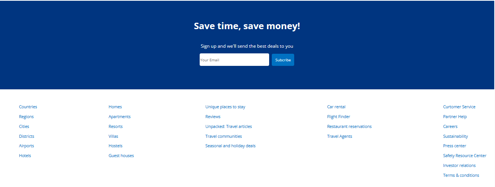

# reactjs-assigment01

<h3 align="center">
   <table>
      <tbody>
        <tr>
          <td align="center" valign="middle">
            
          </td>
          <td align="center" valign="middle">
            
          </td>
          <td align="center" valign="middle">
            
          </td>
          <td align="center" valign="middle">
            
          </td>
          <td align="center" valign="middle">
            
          </td>
        </tr>
      </tbody>
    </table>
</h3>

<h2>💿 Installation</h2>

Run vscode in the terminal:

<ol>
  <li>
    <code>$ npm install</code>
  </li>
  <li>
    <code>$ npm start</code>
  </li>
  <li>You're all set! 🎉</li>
</ol>
